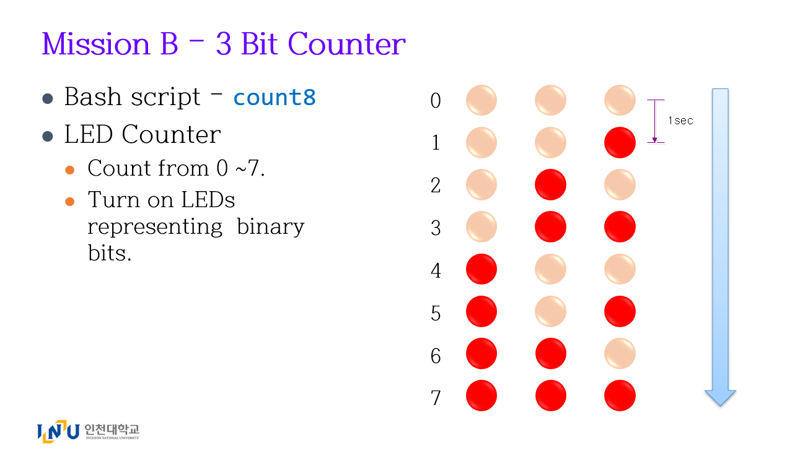
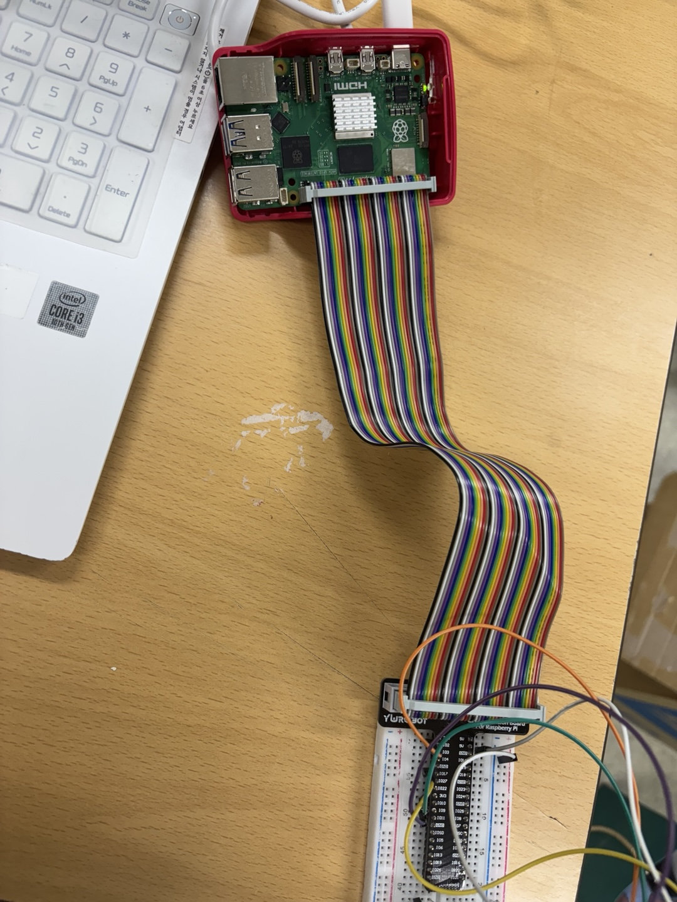
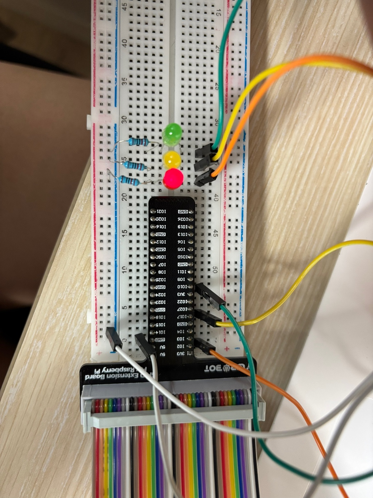
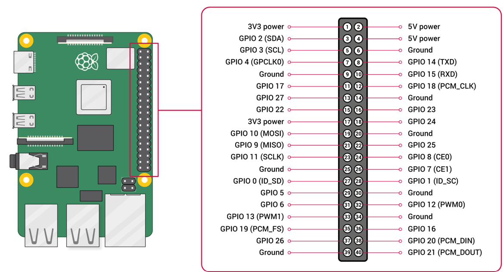

# 📌 임베디드통신시스템 5주차 과제2

## 📖 소개

[임베디드통신시스템]강의의 5주차 두 번째 과제로 라즈베리 파이와 GPIO를 이용하여 LED를 각각 다른 시간동안 깜빡이도록 제어하는 시스템을 만들어보았습니다. 

## 과제 설명



- 첫 번째 LED 1초마다 깜빡임
- 두 번째 LED 2초마다 깜빡임 
- 세 번째 LED 4초마다 깜빡임

### 해결 순서
1. count 폴더 만들기
2. count 폴더 안에 count8라는 source파일 만들기
3. count8 파일 내용 편집하기 
4. 라즈베리 파이와 브레드 보드 연결하기
5. 브레드 보드에 점퍼선, LED, 저항을 사용하여 회로 구성하기 
6. count8 파일 실행 권한 주기
7. count8 파일 실행하기 

---
## 동작 시연 영상

아래 사진을 클릭하면 동작이 시연되는 것을 확인해볼 수 있습니다.

[](https://www.youtube.com/watch?v=edoUWzwg5vY)

--- 
## 하드웨어
직접 연결한 회로도 사진입니다. 




핀 번호는 제 마음대로 배정하였습니다. (0, 1번 핀 제외)

| LED 순서 | 핀 번호 | 역할 |
|----------|---------|----|
|   첫 번째  | 2번 핀 (IO2) | 1초마다 깜빡거림 |
|   두 번째  | 17번 핀 (IO17) | 2초마다 깜빡거림 |
|   세 번째  | 10번 핀 (IO10) | 4초마다 깜빡거림 |

---

## 소프트웨어

```bash
#!/usr/bin/bash

# 핀 번호 설정 
pin1=2 
pin2=17
pin3=10

# 각 핀을 출력 모드(op)로 설정
pinctrl set $pin1 op 
pinctrl set $pin2 op
pinctrl set $pin3 op

while true; do # 무한 반복 
    for i in {0..7}; do # 0~7까지 반복 
        # 처음에 세 개의 핀 모두 끔
        pinctrl set $pin1 dl  
        pinctrl set $pin2 dl
        pinctrl set $pin3 dl

        if (( (i/1)%2 )); then # pin1 1초마다 깜빡임
            pinctrl set $pin1 dh
        fi
        if (( (i/2)%2 )); then # pin2 2초마다 깜빡임
            pinctrl set $pin2 dh
        fi
        if (( (i/4)%2 )); then # pin3 4초마다 깜빡임
            pinctrl set $pin3 dh
        fi
        sleep 1 # 1초 유지 
    done
done
```

### 명령어 정리
디렉토리, 파일 관련
- ls : 현재 디렉토리에 있는 디렉토리와 파일 목록을 보여줌.
- mkdir count : count라는 디렉토리 만듦. 
- cd count/ : count 디렉토리로 이동 
- touch count8 : count8 파일을 만듦.  
- nano count8 : count8 파일 내용 편집 (다른 편집기를 사용해도 좋음.) 
    - 위에 있는 bash코드 작성 
- cat count8 : 터미널에서 파일 내용 확인 가능함. 
- ls -l : 읽기, 쓰기, 실행권한 여부를 보여줌. (여기서는 실행 권한이 있는지 확인하기 위해 쓰임.)    
    - rwx
- source ~/.profile : 현재 쉘 세션에서 ~/.profile 파일을 다시 실행하도록 함.
- which count8 : count8 파일의 위치를 알려줌. 
- ./bin/count/count8  : count8 코드 실행.

GPIO 관련 
- pinctrl -p get : 현재 모든 GPIO 핀의 상태를 출력
- pinctrl set 핀 번호 __ 
    - ex : pinctrl set 2 op    

    | 필드(__)	| 의미 |    
    |-------|--------|    
    | ip  | 입력(Input) 모드 |   
    | op  | 출력(Output) 모드 |
    | pu  | Pull-up |
    | pd  | Pull-down |
    | dh  | 출력 상태가 High (1) |
    | dl  | 출력 상태가 Low (0)  |
    | no  | 미설정(Not used) 상태  |

___
## 주의 & 참고 사항

- GPIO 핀에서 0번과 1번은 아두이노와 연결할 때 쓰이며 일반적인 GPIO 용도로는 사용되지 않습니다. 
- 코드의 첫 번째 줄에 있는 #!/usr/bin/bash는 쉬뱅(Shebang)라인으로 스크립트 파일을 실행할 때, 어떤 프로그램(해석기, 인터프리터) 로 실행할지 지정하는 역할을 합니다. 